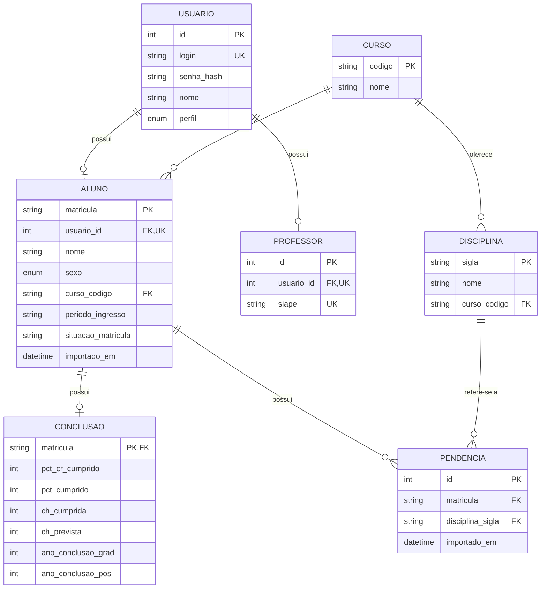
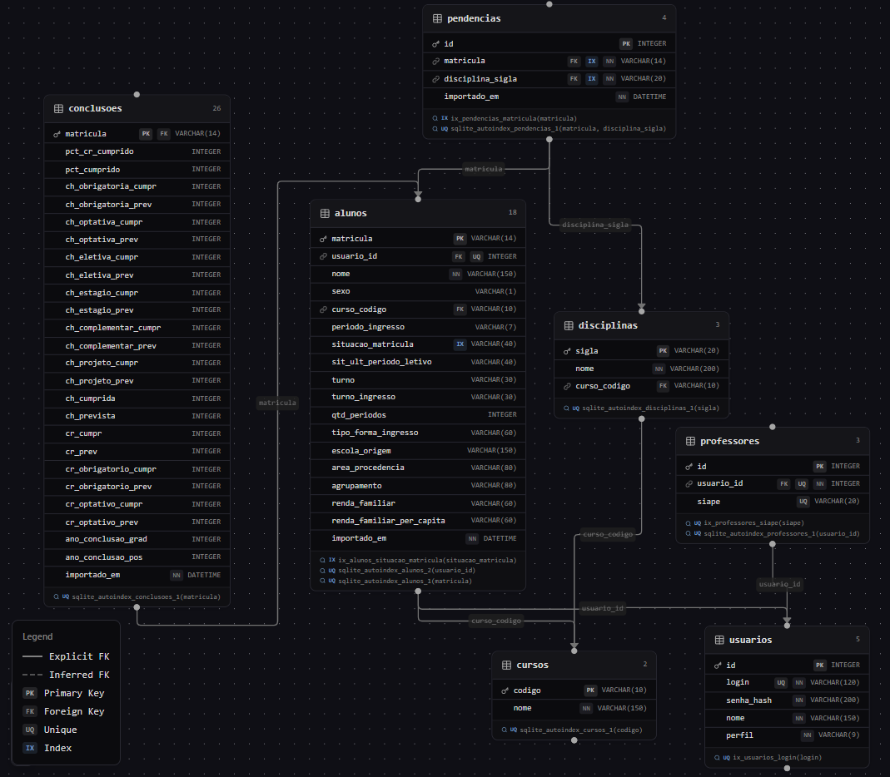

# 🎓 Sistema Acadêmico Desktop

Sistema desktop com autenticação e dois perfis (Professor / Aluno).
Desenvolvido em **Python + PySide6 + SQLAlchemy + SQLite**, com importação
de planilhas Excel e dashboards diferenciados por perfil.

## ✨ Funcionalidades

| ID | Usuário | História de Usuário | Descrição | Critérios de Aceitação |
|---|---|---|---|---|
| HU01 | USUÁRIO | Cadastro de usuário | Como usuário do sistema, quero realizar meu cadastro informando meus dados e meu perfil, para poder acessar o sistema posteriormente. | • Permitir informar os dados obrigatórios.<br>• Permitir selecionar o perfil (Professor ou Aluno).<br>• Validar campos obrigatórios e formato dos dados.<br>• Impedir cadastro com usuário/e-mail já existente.<br>• Exibir confirmação após cadastro realizado. |
| HU02 | USUÁRIO | Realizar login | Como usuário cadastrado, quero realizar login utilizando minhas credenciais, para acessar as funcionalidades disponíveis para o meu perfil. | • Permitir informar usuário/e-mail e senha.<br>• Validar as credenciais informadas.<br>• Impedir acesso com credenciais inválidas.<br>• Direcionar o usuário para a área correspondente ao seu perfil após o login. |
| HU03 | PROFESSOR | Acessar área do professor | Como professor autenticado, quero acessar uma área específica para professores, para visualizar funcionalidades e informações relacionadas ao meu perfil. | • Usuário autenticado como professor deve ter acesso à área do professor.<br>• Usuário aluno não deve ter acesso a essa área.<br>• Exibir as funcionalidades disponíveis para professores. |
| HU04 | ALUNO | Acessar área do aluno | Como aluno autenticado, quero acessar uma área específica para alunos, para visualizar funcionalidades e informações relacionadas ao meu perfil. | • Usuário autenticado como aluno deve ter acesso à área do aluno.<br>• Usuário professor não deve ter acesso às funcionalidades exclusivas do aluno.<br>• Exibir as informações disponíveis para o aluno. |
| HU05 | USUÁRIO | Encerrar sessão | Como usuário autenticado, quero encerrar minha sessão, para impedir que outra pessoa utilize minha sessão no sistema. | • Disponibilizar opção para sair do sistema.<br>• Encerrar a sessão do usuário após a ação.<br>• Impedir acesso às áreas restritas após o logout sem novo login. |
| HU06 | PROFESSOR | Importar planilhas da coordenação | Como professor autenticado, quero importar as planilhas enviadas pela coordenação, para popular o sistema com dados atualizados dos alunos. | • Permitir ao professor selecionar e importar planilhas em formato definido pelo sistema.<br>• Validar o formato e a estrutura dos arquivos.<br>• Informar erros caso a planilha seja inválida.<br>• Armazenar os dados importados no banco de dados.<br>• Informar ao professor quando a importação for concluída. |
| HU07 | PROFESSOR | Visualizar dashboard geral | Como professor autenticado, quero visualizar um dashboard com indicadores gerais do curso, para apoiar a tomada de decisão. | • Permitir ao professor acessar o dashboard geral.<br>• Exibir indicadores acadêmicos do curso.<br>• Apresentar os dados provenientes das planilhas importadas.<br>• Permitir visualizar os indicadores de forma clara.<br>• Atualizar os indicadores após uma nova importação de dados. |
| HU08 | ALUNO | Visualizar dashboard individual | Como aluno autenticado, quero visualizar um dashboard individual com minha situação acadêmica, para saber o que falta para me formar. | • Permitir ao aluno acessar seu dashboard individual.<br>• Exibir somente os dados acadêmicos relacionados ao próprio aluno.<br>• Apresentar sua situação acadêmica e requisitos pendentes.<br>• Atualizar as informações conforme os dados disponíveis no sistema.<br>• Impedir que o aluno visualize dados de outros alunos. |

## 🗂️ Estrutura

```
database/     -> Models SQLAlchemy e sessão
controllers/  -> Regras de negócio (cadastro, login)
views/        -> Telas PySide6
utils/        -> Hash de senha e importador de planilhas
scripts/      -> Utilitários (gerador de planilha exemplo)
main.py       -> Ponto de entrada
```

## ⚙️ Como executar

1. **Clone e crie um ambiente virtual**

   ```bash
   git clone <url-do-seu-repo>
   cd sistema_academico
   python -m venv .venv
   # Windows
   .venv\Scripts\activate
   # Linux/Mac
   source .venv/bin/activate
   ```

2. **Instale as dependências**

   ```bash
   pip install -r requirements.txt
   ```

3. **Execute**

   ```bash
   python main.py
   ```

   O banco `sistema_academico.db` será criado automaticamente na primeira execução.

## 🧪 Testando

1. Rode `python scripts/gerar_planilha_exemplo.py` para gerar `alunos_exemplo.xlsx`.
2. Cadastre um **Professor**, informando o número de SIAPE, na tela inicial.
3. Faça login e clique em **Importar Planilha de Alunos**.
4. Faça logout e entre com um aluno importado
   (login = e-mail da planilha, **senha = matrícula**).

## 📐 Modelo Entidade-Relacionamento (MER)

O banco de dados é composto pelas entidades `Usuario`, `Aluno`, `Professor`,
`Curso`, `Disciplina`, `Conclusao` e `Pendencia`.



As planilhas importadas da coordenação do curso de forma pura tem muitas colunas que são ignoradas no projeto pois não são necessárias para os dashboards que aparecem nesse MVP. Todas as colunas podem ser verificadas a seguir:

imagem gerada no site https://jurerotar.github.io/sqlite-erd/

### Cardinalidades

- Um `Usuario` pode estar associado a zero ou um `Aluno` e a zero ou um `Professor`.
- Um `Curso` possui zero ou vários `Alunos` e `Disciplinas`.
- Um `Aluno` pertence a zero ou um `Curso`.
- Um `Aluno` possui zero ou uma `Conclusao`; `Conclusao` usa a matrícula do aluno como chave primária e estrangeira.
- Um `Aluno` possui zero ou várias `Pendencias`, e cada `Pendencia` referencia uma `Disciplina`.
- A associação entre `Aluno` e `Disciplina` é representada por `Pendencia`, com combinação `matricula + disciplina_sigla` única.

## 🔒 Segurança

- Senhas armazenadas com **bcrypt** (nunca em texto puro).
- Sessão encerrada explicitamente via botão *Encerrar sessão*.
