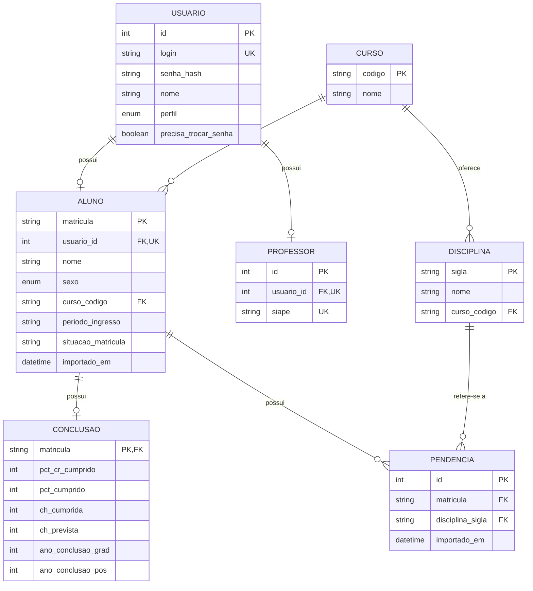

# 🎓 Sistema Acadêmico Desktop

Sistema desktop com autenticação e dois perfis (Professor / Aluno).
Desenvolvido em **Python + PySide6 + SQLAlchemy + SQLite**, com importação
de planilhas Excel e dashboards diferenciados por perfil.

## ✨ Funcionalidades

- Cadastro de professores com número de SIAPE — HU01
- Login com validação de credenciais — HU02
- Área exclusiva do Professor com importação de planilha e estatísticas — HU03
- Área exclusiva do Aluno com dados individuais — HU04
- Encerramento de sessão (logout) — HU05

## 🗂️ Estrutura

```
database/     -> Models SQLAlchemy e sessão
controllers/  -> Regras de negócio (cadastro, login)
views/        -> Telas PySide6
utils/        -> Hash de senha e importador de planilhas
scripts/      -> Utilitários (gerador de planilha exemplo)
main.py       -> Ponto de entrada
```

## ⚙️ Como executar

1. **Clone e crie um ambiente virtual**

   ```bash
   git clone <url-do-seu-repo>
   cd sistema_academico
   python -m venv .venv
   # Windows
   .venv\Scripts\activate
   # Linux/Mac
   source .venv/bin/activate
   ```

2. **Instale as dependências**

   ```bash
   pip install -r requirements.txt
   ```

3. **Execute**

   ```bash
   python main.py
   ```

   O banco `sistema_academico.db` será criado automaticamente na primeira execução.

## 🧪 Testando

1. Rode `python scripts/gerar_planilha_exemplo.py` para gerar `alunos_exemplo.xlsx`.
2. Cadastre um **Professor**, informando o número de SIAPE, na tela inicial.
3. Faça login e clique em **Importar Planilha de Alunos**.
4. Faça logout e entre com um aluno importado
   (login = e-mail da planilha, **senha = matrícula**).

## 📐 Modelo Entidade-Relacionamento (MER)

O banco de dados é composto pelas entidades `Usuario`, `Aluno`, `Professor`,
`Curso`, `Disciplina`, `Conclusao` e `Pendencia`.



As planilhas importadas da coordenação do curso de forma pura tem muitas colunas que são ignoradas no projeto pois não são necessárias para os dashboards que aparecem nesse MVP. Todas as colunas podem ser verificadas a seguir:


### Cardinalidades

- Um `Usuario` pode estar associado a zero ou um `Aluno` e a zero ou um `Professor`.
- Um `Curso` possui zero ou vários `Alunos` e `Disciplinas`.
- Um `Aluno` pertence a zero ou um `Curso`.
- Um `Aluno` possui zero ou uma `Conclusao`; `Conclusao` usa a matrícula do aluno como chave primária e estrangeira.
- Um `Aluno` possui zero ou várias `Pendencias`, e cada `Pendencia` referencia uma `Disciplina`.
- A associação entre `Aluno` e `Disciplina` é representada por `Pendencia`, com combinação `matricula + disciplina_sigla` única.

## 🔒 Segurança

- Senhas armazenadas com **bcrypt** (nunca em texto puro).
- Sessão encerrada explicitamente via botão *Encerrar sessão*.