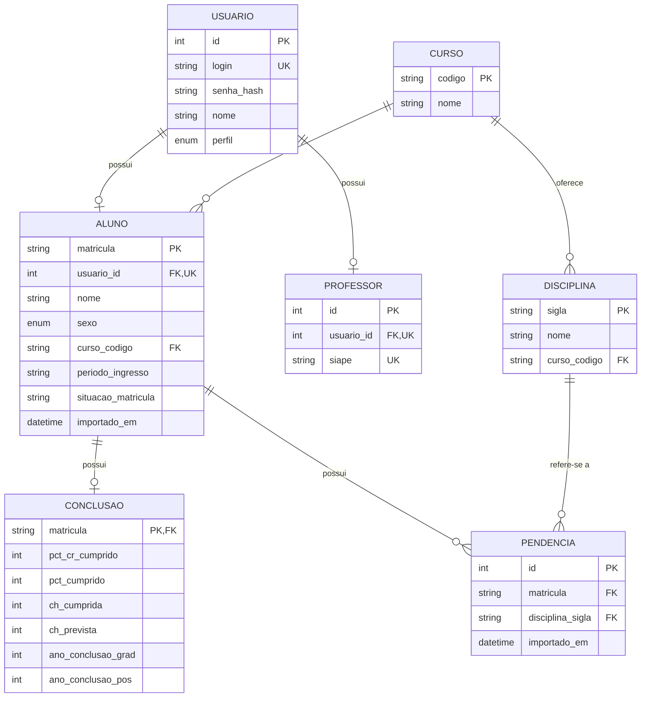
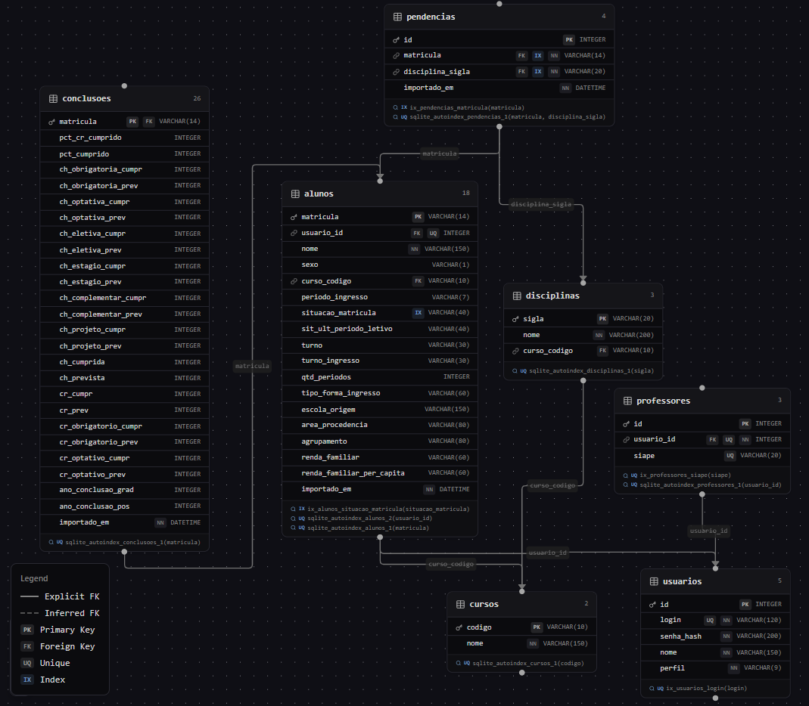

# Sistema Acadêmico Desktop
Este projeto apresenta um sistema de apoio à decisão de gerenciamento de dados para auxiliar no controle de informações acadêmicas em coordenações de cursos. 

## Problemática

O acompanhamento do percurso acadêmico dos estudantes é essencial para identificar situações de retenção, pendências curriculares e dificuldades na conclusão do curso. No entanto, quando essas informações estão dispersas em diferentes planilhas e sistemas, torna-se difícil compreender o cenário geral e transformar dados em decisões.
Este trabalho apresenta o desenvolvimento de um sistema desktop de Business Intelligence (BI) com dashboards para apoiar a análise da trajetória acadêmica dos estudantes do IFCE Campus Cedro.
A proposta foi construída com base em princípios de visualização e comunicação de dados, buscando transformar informações complexas em uma narrativa clara e acessível.
Neste MVP, é possível ver estatísticas gerais sobre o curso no perfil de professor, como taxa de abandono, conclusão, trancamento e gênero dos estudantes. Esses dados são importados de planilhas obtidas pelo Sistema QAcadêmico do IFCE, e são inseridos manualmente no sistema através do botão "Importar dados" no canto superior direito. O perfil de aluno traz informações específicas do estudante logado, como Situação da Matrícula, percentual de conclusão, CH obrigatória, complementar e optativa concluída e ano de ingresso.

## Funcionalidades

| ID | Usuário | História de Usuário | Descrição | Critérios de Aceitação |
|---|---|---|---|---|
| HU01 | USUÁRIO | Cadastro de usuário | Como usuário do sistema, quero realizar meu cadastro informando meus dados e meu perfil, para poder acessar o sistema posteriormente. | • Permitir informar os dados obrigatórios.<br>• Permitir selecionar o perfil (Professor ou Aluno).<br>• Validar campos obrigatórios e formato dos dados.<br>• Impedir cadastro com usuário/e-mail já existente.<br>• Exibir confirmação após cadastro realizado. |
| HU02 | USUÁRIO | Realizar login | Como usuário cadastrado, quero realizar login utilizando minhas credenciais, para acessar as funcionalidades disponíveis para o meu perfil. | • Permitir informar usuário/e-mail e senha.<br>• Validar as credenciais informadas.<br>• Impedir acesso com credenciais inválidas.<br>• Direcionar o usuário para a área correspondente ao seu perfil após o login. |
| HU03 | PROFESSOR | Acessar área do professor | Como professor autenticado, quero acessar uma área específica para professores, para visualizar funcionalidades e informações relacionadas ao meu perfil. | • Usuário autenticado como professor deve ter acesso à área do professor.<br>• Usuário aluno não deve ter acesso a essa área.<br>• Exibir as funcionalidades disponíveis para professores. |
| HU04 | ALUNO | Acessar área do aluno | Como aluno autenticado, quero acessar uma área específica para alunos, para visualizar funcionalidades e informações relacionadas ao meu perfil. | • Usuário autenticado como aluno deve ter acesso à área do aluno.<br>• Usuário professor não deve ter acesso às funcionalidades exclusivas do aluno.<br>• Exibir as informações disponíveis para o aluno. |
| HU05 | USUÁRIO | Encerrar sessão | Como usuário autenticado, quero encerrar minha sessão, para impedir que outra pessoa utilize minha sessão no sistema. | • Disponibilizar opção para sair do sistema.<br>• Encerrar a sessão do usuário após a ação.<br>• Impedir acesso às áreas restritas após o logout sem novo login. |
| HU06 | PROFESSOR | Importar planilhas da coordenação | Como professor autenticado, quero importar as planilhas enviadas pela coordenação, para popular o sistema com dados atualizados dos alunos. | • Permitir ao professor selecionar e importar planilhas em formato definido pelo sistema.<br>• Validar o formato e a estrutura dos arquivos.<br>• Informar erros caso a planilha seja inválida.<br>• Armazenar os dados importados no banco de dados.<br>• Informar ao professor quando a importação for concluída. |
| HU07 | PROFESSOR | Visualizar dashboard geral | Como professor autenticado, quero visualizar um dashboard com indicadores gerais do curso, para apoiar a tomada de decisão. | • Permitir ao professor acessar o dashboard geral.<br>• Exibir indicadores acadêmicos do curso.<br>• Apresentar os dados provenientes das planilhas importadas.<br>• Permitir visualizar os indicadores de forma clara.<br>• Atualizar os indicadores após uma nova importação de dados. |
| HU08 | ALUNO | Visualizar dashboard individual | Como aluno autenticado, quero visualizar um dashboard individual com minha situação acadêmica, para saber o que falta para me formar. | • Permitir ao aluno acessar seu dashboard individual.<br>• Exibir somente os dados acadêmicos relacionados ao próprio aluno.<br>• Apresentar sua situação acadêmica e requisitos pendentes.<br>• Atualizar as informações conforme os dados disponíveis no sistema.<br>• Impedir que o aluno visualize dados de outros alunos. |

## Estrutura

```
database/     -> Models SQLAlchemy e sessão
controllers/  -> Regras de negócio (cadastro, login)
views/        -> Telas PySide6
utils/        -> Hash de senha e importador de planilhas
scripts/      -> Utilitários (gerador de planilha exemplo)
main.py       -> Ponto de entrada
```

## Como executar

1. **Clone e crie um ambiente virtual**

   ```bash
   git clone https://github.com/Caiqueferlima/GerenciamentoAcademico.git
   cd gerenciamentoacademico
   python -m venv .venv

   # Windows
   .venv\Scripts\activate

   # Linux/Mac
   source .venv/bin/activate
   ```

2. **Instale as dependências**

   ```bash
   pip install -r requirements.txt
   ```

3. **Execute**

   ```bash
   python main.py
   ```

   O banco `sistema_academico.db` será criado automaticamente na primeira execução.

## Testando

1. Rode `python scripts/gerar_planilhas_exemplo.py` para gerar as planilhas de exemplo.
2. Cadastre um **Professor** na tela inicial.
3. Faça login e clique em **Importar Planilha de Alunos**.
4. Faça logout e entre com um aluno importado
   (login = matrícula completa, **senha = 4 primeiros dígitos da matrícula**).

## Modelo Entidade-Relacionamento (MER)

O banco de dados é composto pelas entidades `Usuario`, `Aluno`, `Professor`,
`Curso`, `Disciplina`, `Conclusao` e `Pendencia`.


```mermaid
erDiagram
   USUARIO ||--o| ALUNO : "possui"
   USUARIO ||--o| PROFESSOR : "possui"
   CURSO ||--o{ ALUNO : "tem"
   CURSO ||--o{ DISCIPLINA : "oferece"
   ALUNO ||--o| CONCLUSAO : "possui"
   ALUNO ||--o{ PENDENCIA : "possui"
   DISCIPLINA ||--o{ PENDENCIA : "refere-se a"

   USUARIO {
      int id PK
      string login UK
      string senha_hash
      string nome
      enum perfil
   }
   ALUNO {
      string matricula PK
      int usuario_id FK, UK
      string nome
      enum sexo
      string curso_codigo FK
      string periodo_ingresso
      string situacao_matricula
      datetime importado_em
   }
   PROFESSOR {
      int id PK
      int usuario_id FK, UK
      string siape UK
   }
   CURSO {
      string codigo PK
      string nome
   }
   DISCIPLINA {
      string sigla PK
      string nome
      string curso_codigo FK
   }
   CONCLUSAO {
      string matricula PK, FK
      int pct_cr_cumprido
      int pct_cumprido
      int ch_cumprida
      int ch_prevista
      int ano_conclusao_grad
      int ano_conclusao_pos
   }
   PENDENCIA {
      int id PK
      string matricula FK
      string disciplina_sigla FK
      datetime importado_em
   }
```

As planilhas importadas da coordenação do curso de forma pura tem muitas colunas que são ignoradas no projeto pois não são necessárias para os dashboards que aparecem nesse MVP. Todas as colunas podem ser verificadas a seguir:

imagem gerada no site https://jurerotar.github.io/sqlite-erd/

### Cardinalidades

- Um `Usuario` pode estar associado a zero ou um `Aluno` e a zero ou um `Professor`.
- Um `Curso` possui zero ou vários `Alunos` e `Disciplinas`.
- Um `Aluno` pertence a zero ou um `Curso`.
- Um `Aluno` possui zero ou uma `Conclusao`; `Conclusao` usa a matrícula do aluno como chave primária e estrangeira.
- Um `Aluno` possui zero ou várias `Pendencias`, e cada `Pendencia` referencia uma `Disciplina`.
- A associação entre `Aluno` e `Disciplina` é representada por `Pendencia`, com combinação `matricula + disciplina_sigla` única.

## Justificativa das tecnologias

As tecnologias foram escolhidas considerando o caráter desktop do sistema, a necessidade de trabalhar com dados acadêmicos estruturados e a origem dessas informações em planilhas:

- **Python**: permite desenvolver a aplicação de forma rápida, com uma sintaxe simples e um ecossistema amplo para interfaces gráficas, persistência de dados, tratamento de planilhas e segurança.
- **PySide6**: foi utilizado para construir a interface desktop. Ele oferece componentes gráficos nativos, suporte a múltiplas janelas e integração com sinais e eventos, atendendo aos fluxos de login, cadastro e dashboards por perfil.
- **SQLAlchemy**: atua como ORM e organiza o acesso ao banco por meio de modelos e sessões. Isso reduz a necessidade de escrever SQL manualmente e facilita a manutenção das relações entre usuários, alunos, cursos, disciplinas e pendências.
- **SQLite**: foi escolhido como banco de dados por ser leve, não exigir um servidor separado e ser suficiente para um sistema desktop e para o escopo deste MVP. O arquivo do banco também simplifica a instalação e a execução local.
- **pandas e openpyxl**: permitem ler, validar e transformar as planilhas Excel fornecidas pela coordenação antes de persistir os dados. O pandas facilita o processamento tabular, enquanto o openpyxl fornece o suporte ao formato `.xlsx`.
- **bcrypt**: protege as senhas com hash, evitando seu armazenamento em texto puro e aumentando a segurança do processo de autenticação.

### Desenvolvido por:
<table align="center">
   <tr align="center">
      <td>
         <a href="https://github.com/Caiqueferlima">
         
         <p>Caíque <br/>Fernandes</p>
         </a>
      </td>
   </tr>
